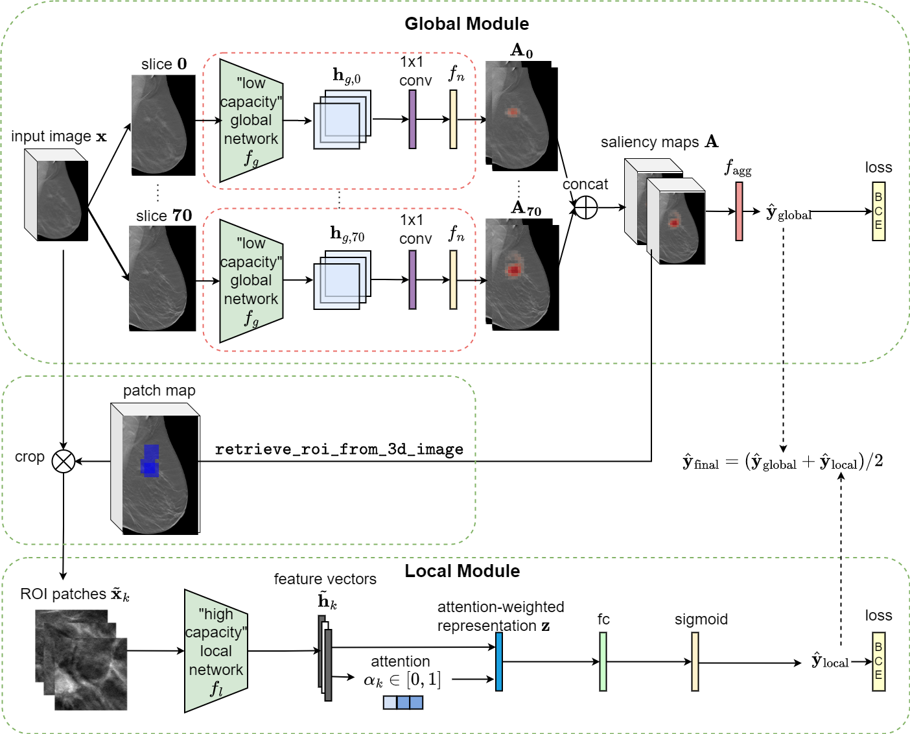
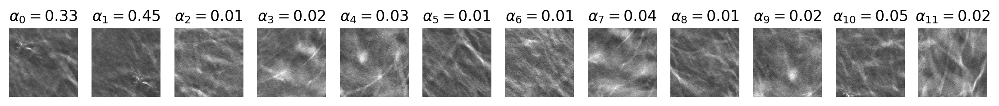

# 3D-GMIC: an efficient deep neural network to find small objects in large 3D images

## Introduction
This is an implementation of the 3D Globally-Aware Multiple Instance Classifier (3D-GMIC) model. The architecture of the proposed model is shown below.



Highlights of 3D-GMIC:
- **High Efficiency**: Compared to off-the-shelf deep convolutional neural networks, 3D-GMIC uses **77.98%-90.05%** less GPU memory and **91.23%-96.02%** less computation.
- **Weakly Supervised Semantic Segmentation**: Despite being trained with only image-level labels indicating the presence of any benign or malignant lesion, 3D-GMIC is able to generate pixel-level saliency maps (shown below) that provide additional interpretability.

The implementation allows users to obtain breast cancer predictions and visualization of saliency maps by applying one of our pretrained models. We provide weights for 5 3D-GMIC models. The model is implemented in PyTorch. 

* Input: A digital breast tomosynthesis image that is cropped to 2116 x 1339. As a part of this repository, we provide 2 sample exams via Google Drive, each of which includes 2 CC view Digital Breast Tomosynthesis (DBT) images and 2 MLO view DBT images. Those exams contain original mammogrphy images and therefore need to be preprocessed (see the Preprocessing section). 

* Output: The 3D-GMIC model generates one prediction for each image: probability of benign and malignant findings. All predictions are saved into a csv file `$OUTPUT_PATH/predictions.csv` that contains the following columns: image_index, benign_pred, malignant_pred, benign_label, malignant_label. In addition, each input image is associated with optional visualization files saved under `$OUTPUT_PATH/visualization`. Exemplar visualization files (`patches.png` and `all_slices_vis.gif`) are illustrated below. The `patches.png` file visualizes ROI proposal patches with the associated attention score on top. The animation `all_slices_vis.gif` shows the following information for all slices of DBT image, scrolling from front to back: 
  * input DBT image,
  * patch map that illustrates the locations of ROI proposal patches (blue squares),
  * saliency map for benign class,
  * saliency map for malignant class.
  



## Prerequisites

* Python (3.6)
* PyTorch (1.1.0)
* torchvision (0.2.2)
* NumPy (1.14.3)
* SciPy (1.0.0)
* imageio (2.4.1)
* pandas (0.22.0)
* opencv-python (3.4.2)
* tqdm (4.19.8)
* matplotlib (3.0.2)
* nibabel (2.4.0)


## License

Please refer to [this file](LICENSE) for details about the license of this repository.

## How to run the code

You need to first install conda in your environment. **Before running the code, please run `pip install -r requirements.txt` first.** 

In addition, please download the sample data from the following link: https://drive.google.com/file/d/163YDLemdWfCspCMHkKz_V3clp45WQKiY/view?usp=sharing

Use the following command to untar the sample data at the top-level of the repository.

```bash
tar -xvf sample_data.tar
```

Once untarred, the DBT images are stored in `sample_data/images` directory and the exam list is stored in `sample_data/exam_list_before_cropping.pkl`.

Once you have installed all the dependencies, `run.sh` will automatically run the entire pipeline and save the prediction results in csv. Note that you need to first cd to the project directory and then execute `bash ./run.sh`. When running the individual Python scripts, please include the path to this repository in your `PYTHONPATH`. 

We recommend running the code with a GPU. To run the code with CPU only, please change `DEVICE_TYPE` in run.sh to 'cpu'. 

The following variables defined in `run.sh` can be modified as needed:
* `MODEL_PATH`: The path where the model weights are saved.
* `CROPPED_IMAGE_PATH`: The directory where cropped mammograms are saved.
* `EXAM_LIST_PATH`: The path where the exam list is stored.
* `OUTPUT_PATH`: The path where visualization files and predictions will be saved.
* `DEVICE_TYPE`: Device type to use in heatmap generation and classifiers, either 'cpu' or 'gpu'.
* `GPU_NUMBER`: GPUs number multiple GPUs are available.
* `MODEL_INDEX`: Which one of the five models to use. Valid values include {'1', '2', '3', '4', '5','ensemble'}.

Optionally, visualization of model predictions can be saved by uncommenting `--visualization-flag` line for the Stage 3 in `run.sh` file (as a commandline argument to src/scripts/run_model.py).

You should obtain the following outputs for the sample exams provided in the repository (found in `sample_output/predictions.csv` by default). 

image_index  |  benign_pred  |  malignant_pred  |  benign_label  |  malignant_label
-------------|---------------|------------------|----------------|-----------------
0_L-CC_0     |  0.0441       |  0.0127          |  0             |  0
0_R-CC_0     |  0.5752       |  0.1765          |  0             |  1
0_L-MLO_0    |  0.0267       |  0.0033          |  0             |  0
0_R-MLO_0    |  0.4332       |  0.6813          |  0             |  1
1_L-CC_0     |  0.0254       |  0.0049          |  0             |  0
1_R-CC_0     |  0.4358       |  0.5262          |  0             |  1
1_L-MLO_0    |  0.1877       |  0.0496          |  0             |  0
1_R-MLO_0    |  0.4900       |  0.4437          |  0             |  1

Note that the predictions could be slightly different depending on machines used.

## Data

`sample_data/images` contains 2 exams each of which includes 4 the original DBT images (L-CC, L-MLO, R-CC, R-MLO). All DBT images are saved in NIFTI format. (Note that it is possible for some DBT images to be stored in different orientations in the original DICOM files. In that case, it may be necessary to manually rotate the images before running our preprocessing pipeline. The NIFTI images in our sample data have been corrected based on `ImageOrientationPatient` DICOM tag.) 

`sample_data/exam_list_before_cropping.pkl` contains a list of exam information. Each exam is represented as a dictionary with the following format:

```python
{
  'horizontal_flip': 'NO',
  'L-CC': ['0_L-CC_0'],
  'L-MLO': ['0_L-MLO_0'],
  'R-MLO': ['0_R-MLO_0'],
  'R-CC': ['0_R-CC_0'],
  'cancer_label': {'unknown': 0,
   'right_malignant': 1,
   'benign': 0,
   'left_malignant': 0,
   'left_benign': 0,
   'right_benign': 0,
   'malignant': 1},
}
```


### Preprocessing

Run the following commands to crop mammograms and calculate information about augmentation windows.

#### Crop mammograms
```bash
python3 src/cropping/crop_mammogram.py \
    --input-data-folder $DATA_FOLDER \
    --output-data-folder $CROPPED_IMAGE_PATH \
    --exam-list-path $INITIAL_EXAM_LIST_PATH  \
    --cropped-exam-list-path $CROPPED_EXAM_LIST_PATH
```
`src/import_data/crop_mammogram.py` crops the mammogram around the breast and discards the background in order to improve image loading time and time to run segmentation algorithm and saves each cropped image to `$PATH_TO_SAVE_CROPPED_IMAGES/short_file_path.nii.gz` using NIFTI format. In addition, it adds additional information for each image and creates a new image list to `$CROPPED_IMAGE_LIST_PATH` while discarding images which it fails to crop. Optional --verbose argument prints out information about each image. The additional information includes the following:
- `window_location`: location of cropping window w.r.t. original dicom image so that segmentation map can be cropped in the same way for training.
- `rightmost_points`: rightmost nonzero pixels after correctly being flipped.
- `bottommost_points`: bottommost nonzero pixels after correctly being flipped.
- `distance_from_starting_side`: records if zero-value gap between the edge of the image and the breast is found in the side where the breast starts to appear and thus should have been no gap. Depending on the dataset, this value can be used to determine wrong value of `horizontal_flip`.
- `num_slices`: the number of slices in each DBT image.


#### Calculate optimal centers
```bash
python3 src/optimal_centers/get_optimal_centers.py \
    --cropped-exam-list-path $CROPPED_EXAM_LIST_PATH \
    --data-prefix $CROPPED_IMAGE_PATH \
    --output-exam-list-path $EXAM_LIST_PATH
```
`src/optimal_centers/get_optimal_centers.py` outputs new exam list with additional metadata to `$EXAM_LIST_PATH`. The additional information includes the following:
- `best_center`: optimal center point of the window for each image. Refer to [the data report](https://cs.nyu.edu/~kgeras/reports/datav1.0.pdf) for more details.

During inference, we horizontally flipped `R-CC` and `R-MLO` images so that all four views face right. As such, these best_center points are with respect to such flipped images.

#### Outcomes of preprocessing
After the preprocessing step, you should have the following files in the `$OUTPUT_PATH` directory (default is sample_output):
- cropped_images: a folder that contains the cropped images corresponding to all images in the sample_data/images.
- data.pkl: the pickle file of a data list that includes the preprocessing metadata for each image and exam.


## Reference

If you found this code useful, please cite our paper:

**3D-GMIC: an efficient deep neural network to find small objects in large 3D images**\
Jungkyu Park, Jakub Chłędowski, Stanisław Jastrzębski, Jan Witowski, Yanqi Xu, Linda Du, Sushma Gaddam, Eric Kim, Alana Lewin, Ujas Parikh, Anastasia Plaunova, Sardius Chen, Alexandra Millet, James Park, Kristine Pysarenko, Shalin Patel, Julia Goldberg, Melanie Wegener, Linda Moy, Laura Heacock, Beatriu Reig, Krzysztof J. Geras\
2022

    @article{park20223d, 
        title = {3D-GMIC: an efficient deep neural network to find small objects in large 3D images},
        author = {Jungkyu Park, Jakub Ch\l{}\k{e}dowski, Stanis\l{}aw Jastrz\k{e}bski, Jan Witowski, Yanqi Xu, Linda Du, Sushma Gaddam, Eric Kim, Alana Lewin, Ujas Parikh, Anastasia Plaunova, Sardius Chen, Alexandra Millet, James Park, Kristine Pysarenko, Shalin Patel, Julia Goldberg, Melanie Wegener, Linda Moy, Laura Heacock, Beatriu Reig, Krzysztof J. Geras.}, 
        journal = {arXiv:2210.08645},
        year = {2022}
    }
    
